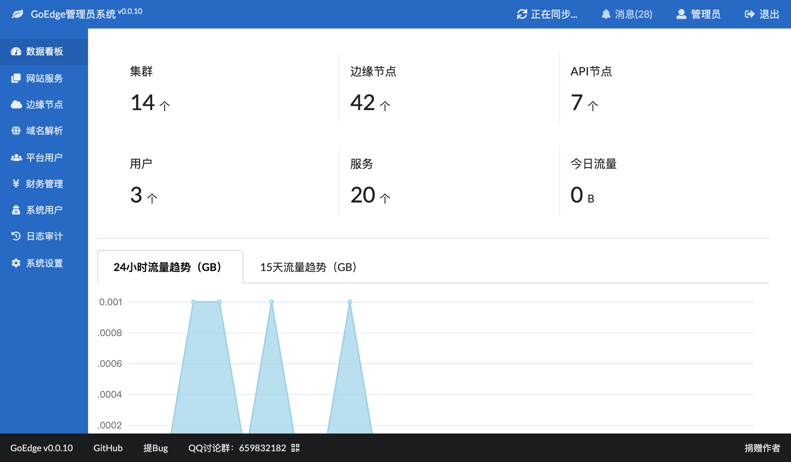
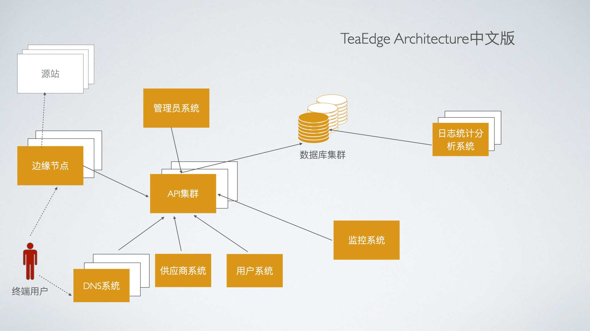

# GoEdge目标
做一款人人用得起的CDN & WAF系统。

## 特性
* `免费` - 开源、免费、自由、开放
* `简单` - 架构简单清晰，安装简单，使用简单，运维简单
* `高扩展性` - 可以自由扩展新的节点，支持亿级数据

## 文档
* [新手指南](https://edge.teaos.cn/docs/QuickStart/Index.md)
* [完整文档](https://edge.teaos.cn/docs)
* [开发者指南](https://edge.teaos.cn/docs/Developer/Build.md)

## 架构

其中的组件源码地址如下：
* [边缘节点](https://github.com/TeaOSLab/EdgeNode)
* [API节点](https://github.com/TeaOSLab/EdgeAPI)
* [管理平台](https://github.com/TeaOSLab/EdgeAdmin)

## 联系我们
有什么问题和建议都可以加入QQ群 `659832182`。

## 感谢
* 感谢[JetBrains公司](https://www.jetbrains.com/)提供免费的IDE开发Licence。
* 感谢[Gitee](https://gitee.com/)提供国内源代码托管平台