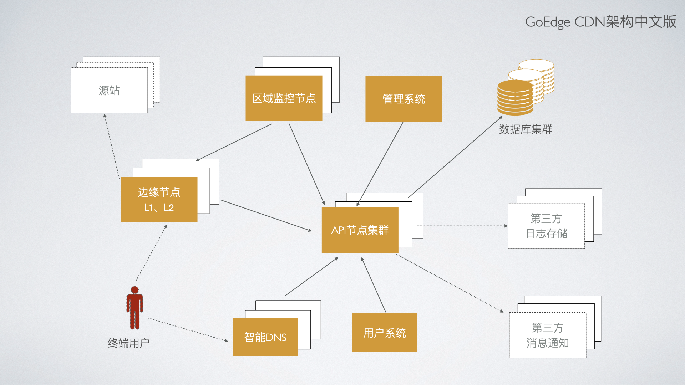

# GoEdge目标
做一款人人用得起的CDN & WAF系统。

## 特性
* `免费` - 开源、免费、自由、开放
* `简单` - 架构简单清晰，安装简单，使用简单，运维简单
* `高扩展性` - 可以自由扩展新的节点，支持亿级数据

## 功能介绍
* 多用户
* 日志审计
* 集群管理
* HTTP/HTTPS/TCP/UDP等协议支持
* WAF
* 缓存
* DNS自动解析
* 多域名绑定
* 免费证书申请
* IP黑白名单
* 访问日志
* 统计
* 内容压缩
* Protocol Proxy协议
* 本地静态文件
* URL跳转
* 路由规则
* 重写规则
* 访问控制
* 字符编码
* 自定义页面
* 自定义HTTP Header
* Websocket
* WebP自动转换
* Fastcgi
* 请求限制
* 流量限制

## 在线演示
* [http://demo.goedge.cn](http://demo.goedge.cn)

## 文档
* [新手指南](https://goedge.cn/docs/QuickStart/Index.md)
* [完整文档](https://goedge.cn/docs)
* [开发者指南](https://goedge.cn/docs/Developer/Build.md)

## 架构

其中的组件源码地址如下：
* [边缘节点](https://github.com/GoEdgeLab/EdgeNode)
* [API节点](https://github.com/GoEdgeLab/EdgeAPI)
* [管理平台](https://github.com/GoEdgeLab/EdgeAdmin)

## 联系我们
有什么问题和建议都可以加入 [Telegram群](https://t.me/goedgecloud) 

## 企业版
* [GoEdge企业版](https://goedge.cn/commercial) - 功能更强大的CDN系统
